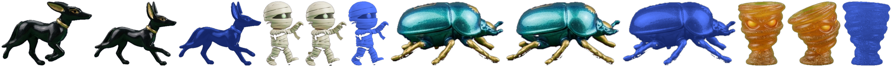

# GRISHNAK

An arcade universe in one HTML page.

**[Play it now](https://scovert.com/grishnak/)** — no install, no account, no loading bar. Any modern browser.

## What this is

GRISHNAK is a hand-built world of more than twenty games that share one map, one
save, and one story. You walk a kingdom maze, and the things you find in it —
a wrecked ship in a wheat field, a cracked door in a cave wall, an arcade
cabinet standing where no cabinet should be — are doors into whole other games:
a 35-wall breakout cabinet, a maze-chase played on running 3D roads, asteroids,
caverns, a chess gauntlet, a river, a bullring.

It began as a Commodore 64 game the author wrote in the 1980s. It is being
rebuilt and expanded, in public, as one page of vanilla JavaScript.

## Direct doors

Every big space has a front door you can link or share:

| Link | Where it lands |
|---|---|
| [?g=stonebreaker](https://scovert.com/grishnak/?g=stonebreaker) | STONEBREAKER — 35 walls and the Warlord |
| [?g=waka](https://scovert.com/grishnak/?g=waka) | 3D WAKA — maze-chase on the high roads |
| [?g=wakasphere](https://scovert.com/grishnak/?g=wakasphere) | WAKA SPHERE — the maze bends into a planet |
| [?g=omega](https://scovert.com/grishnak/?g=omega) | OMEGA RUN — asteroids with a temper |
| [?g=monty](https://scovert.com/grishnak/?g=monty) | MONTY ZOOM — the caverns |
| [?g=fireball](https://scovert.com/grishnak/?g=fireball) | FIREBALL MAZE |
| [?g=jungle](https://scovert.com/grishnak/?g=jungle) | JUNGLE HUNT |
| [?g=moonwalk](https://scovert.com/grishnak/?g=moonwalk) | MOONWALK |
| [?g=contraption](https://scovert.com/grishnak/?g=contraption) | THE CONTRAPTION |

Press ESC inside any of them and you are back on the kingdom map, standing
where the door is.

## How it's built

- **Vanilla JavaScript and Canvas. Zero dependencies, zero frameworks, no
  build step.** Clone it, open `index.html`, you are playing.
- One page, many layers: each game is its own `mini-*.js` or `kingdom-*.js`
  file that plugs into the shared shell (input, save, transitions, sound).
- The art direction for the newest casts is **photographed toys**: character
  sheets generated as realistic glossy plastic figures, chroma-keyed and
  packed into sprite atlases. The full source sheets ship in `images/` so you
  can see exactly how the pipeline works.
- Developed against a private fleet of 51 headless test suites that pin
  everything from wall geometry to ghost personalities.

## The deal

Take it. Learn from it. Build your own rooms.

- **Code: MIT.** Do what you like, keep the notice.
- **Art and sound: CC BY 4.0.** Use them anywhere, credit GRISHNAK.

**[UNIVERSE.md](UNIVERSE.md) is the guide to expanding it** — the register, the
naming laws, the build law, the art pipeline, and the layer contract a new game
plugs into. Read that and you can add a room that belongs. If you build
something on this, open an issue and show it.

## Author

Scott Covert — [scovert.com](https://scovert.com). The kingdom is live at
[scovert.com/grishnak](https://scovert.com/grishnak/).
